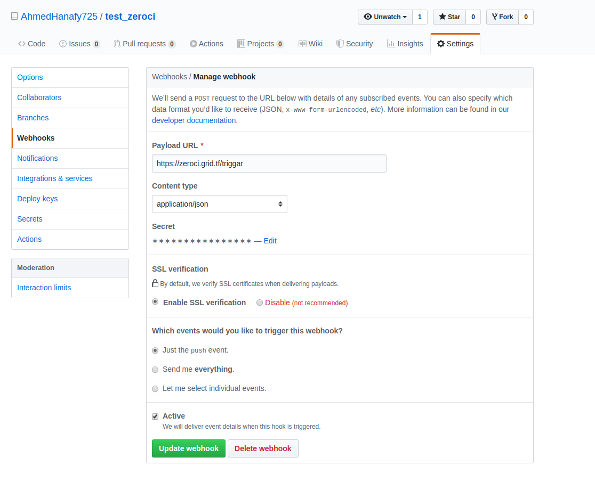

## Zero Continuous-Integration:

ZeroCI is continuous integration dedicated for python projects that generates junit test summary into xml file.

### Server life cycle:

#### There are two scenarios:

##### 1- Pushing in repo already defined in config file, the following steps will be done:

    - Create a job on rq and store it in redis.
    - There are 5 workers waiting for jobs, one of them will take this job and start to execute it.
    - Create a vm using flist on freefarm.
    - Get installation and tests commands from zeroCI.yaml file for this commit.
    - Run installation commands against this vm.
    - Store the result in DB (mongodb) in failure case.
    - Run tests commands one by one against this vm.
    - Store the result in DB (mongodb).
    - Send result url to Telegram and update commit status om github.

##### 2- Run nightly testsuites:

    - Make post request with install commands, tests commands, timeout, execution time.
    - Store this job in rq scheduler.
    - rq scheduler will run this job on its execution time on rq workers.
    - Create a vm using flist on freefarm.
    - Get installation and tests commands from rq scheduler.
    - Run installation commands against this vm.
    - Store the result in DB (mongodb) in failure case.
    - Run tests commands one by one against this vm.
    - Store the result in DB (mongodb).
    - Send result url to Telegram.

### Installation:

#### Requirements:

- Create a vm with Ubuntu:18.04.
- Install [JSX](https://github.com/threefoldtech/jumpscaleX_core/tree/development/docs/Installation)
- Create a Telegram group chat.
- Create Telegram bot and add it to this group chat.
- Install mongodb `apt-get install -y mongodb`
- Install redis `apt-get install -y redis`
- Install packages required `pip3 install -r requirement.txt`


#### Configuration:

- config.toml:

```
[main]
domain=                             # The domain that will point to your server
result_path=                        # The result log file will stored in

[telegram]
chat_id=                            # Telegram chat ID
token=                              # Telegram bot token

[iyo]
id=                                 # itsyouonline ID
secret=                             # itsyouonline secret

[github]
access_token=                       # Github access token for user
repo=                               # list of  repositories Full name that will run on your zeroCI

[db]
name=                               # db name will be used to store the result in
host=                               # hostname that mongodb is running on (exp: localhost)
port=                               # port that mongodb is running on

[environment]                       # under this a list of environment variables needed to be exported before running tests.
```

- Add server IP as webhook in Repository's settings.

#### How to run the server:

Before running this script this repository should be in this path`/opt/code/github/AhmedHanafy725/zeroCI`
```bash
./run.sh
```

### Github repository configuration:

#### 1- Webhook:

Go to the repository's setting needed to configure the webhook
- Add the ip of the server ended with `/triggar`
- Content type should be `application/json`
- Select when the webhook will trigger the server (**Note:** Just the push event is supported for now)


#### 2- zeroCI.yaml:

- This file should be at the home of the repository with name `zeroCI.yaml`.
- Should contain the project prerequisites, installation and tests:
    - `prequisties`: requirement needed to be installed before start installing the project.
    (**Note:** `jsx` and `docker` only supported)
    - `install`: list of bash command lines for how to install the project.
    - `script`: list of bash command lines for how to run the tests ([more details](#zeroci-script-configuration)).


#### 3- Server configuration:

- Full name of the repository should be added in `config.toml`.
- Restart the server `systemctl restart zeroci`

### Getting the results:

#### 1- The server front-end itself:

- Go to server ip that has been already added in `config.toml`
- Once the repository has commit will be found.
  
- When the test finishes, the status will be updated.
  
- result id can be pressed for [result details](#result-details).
(**Note:** if the branch used is `development`, will find a card with the status in server dashboard)


#### 2- Github status

- Once the repository has commit go to repository commits.
  
- When the test finishes, the status should be updated.
  
- `details` can be pressed for [result details](#result-details).

#### 3- Telegram group chat:

- In telegram group chat has been created in requirement step and added in `config.toml`, a message will be send to it once the test finishes.

  
- `Result` button can be pressed for [result details](#result-details).

#### Result details:

- Black formatting will appear at the beginning.
- Then the rest of tests added in [zeroci](#2--zerociyaml) in `script` field.
  

- For more details about every test, test name can be pressed.
  
  (**Note:** if the test running does not generate junit test summary xml file, the result will appear in log format as running in shell.)

### zeroci script configuration:

This part is important for getting result in this [view](#result-details)

#### Nosetests:

`--with-xunit`: to enable the plugin to generate junit test summary xml file.
`--xunit-file`: specify the output file name, in this case MUST be `/test.xml`.  
`--xunit-testsuite-name`: name of testsuite that will appear in the result.

**Example:**
```bash
nosetests-3.4 -v testcase.py --with-xunit --xunit-file=/test.xml --xunit-testsuite-name=Simple_nosetest
```
For more details about the plugin [Xunit](https://nose.readthedocs.io/en/latest/plugins/xunit.html)

#### Pytest:

`--junitxml`: to enable the plugin and specify the output file name, in this case MUST be `/test.xml`.

`-o junit_suite_name`: name of testsuite that will appear in the result.

**Example:**
```bash
pytest -v testcase.py --junitxml=/test.xml -o junit_suite_name=Simple_pytest
```
For more details about the plugin [junitxml](https://docs.pytest.org/en/latest/usage.html#creating-junitxml-format-files)

### Nightly tests:

There is an API for adding nightly testsuite, but its pages not added yet.
